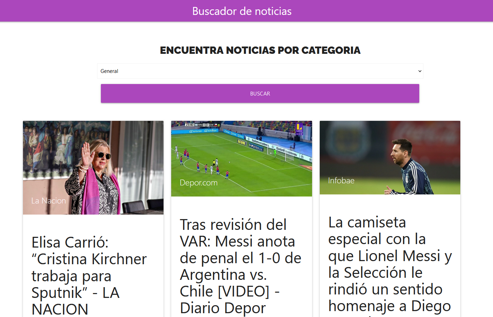
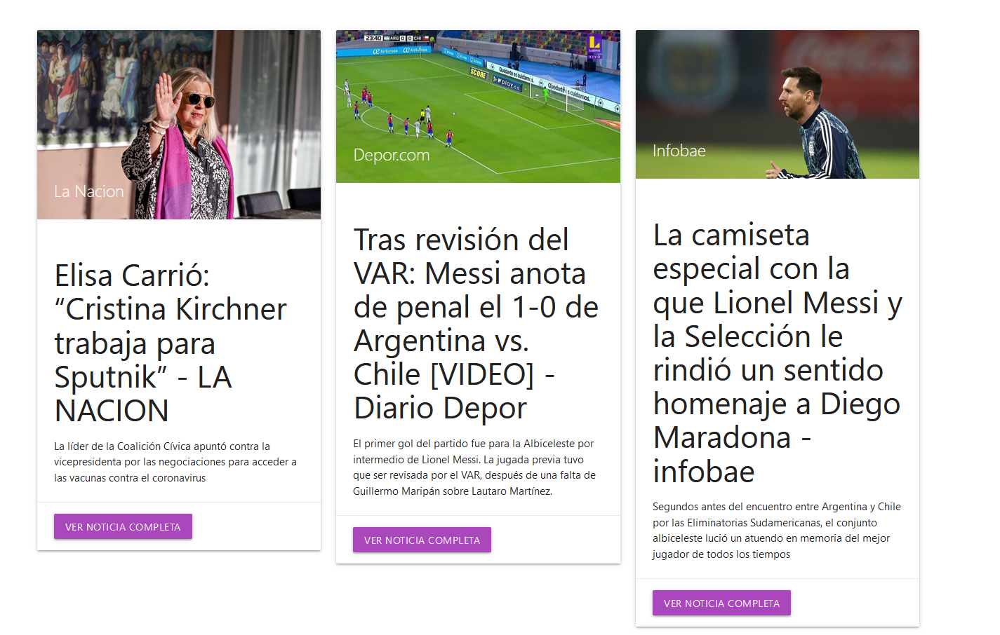

In this project, i developed a webapp that shows news from Argentina.

The user can select different categories, for example; health,technology,sports,etc.

i've used the newsapi.org api. Sadly i was not able to deploy a live version since it's a paid API.

but you can still download the project and test it out!

Here are some pictures of the UI!

